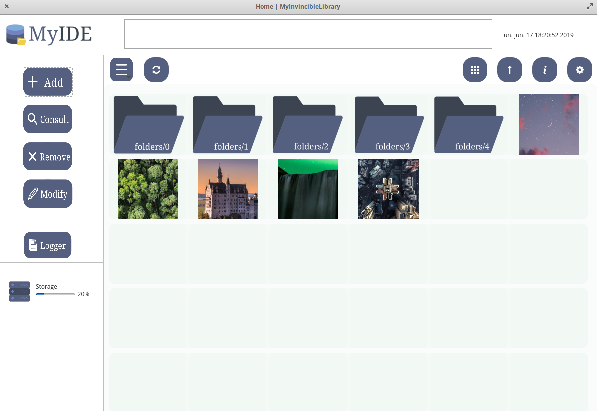
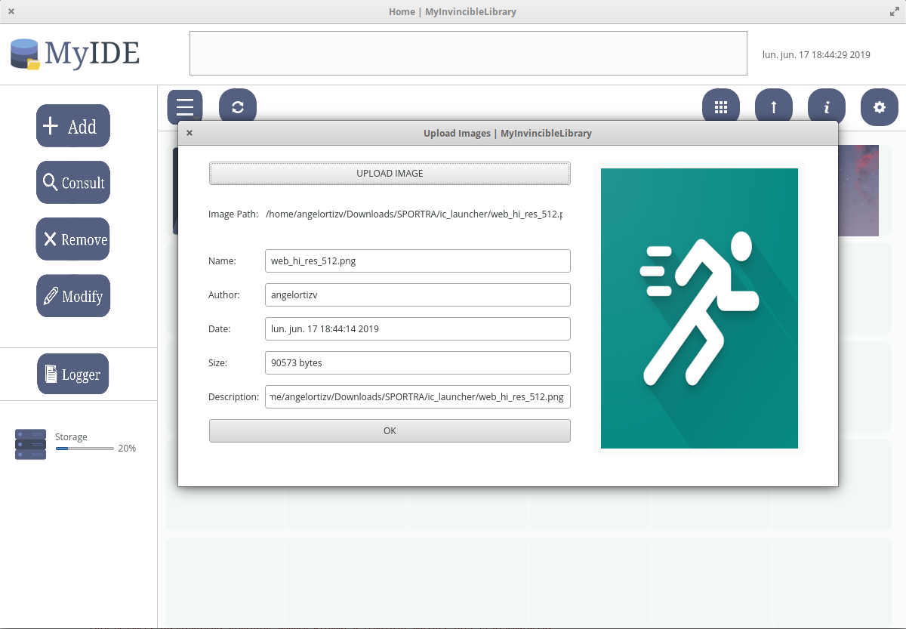
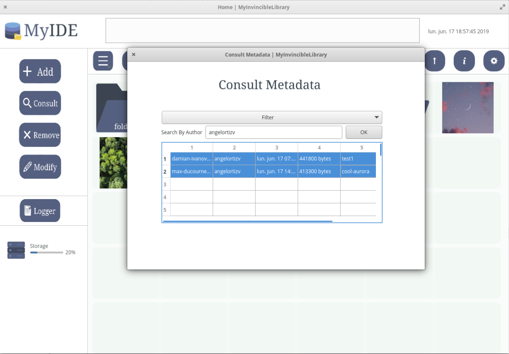

<p align="center">
  
</p>
  
<p align="center">
<a href="https://github.com/ce-itcr/MyInvincibleLibrary/blob/master/LICENSE"></a>
 <a href=""></a>
 <a href="https://github.com/ce-itcr/MyInvincibleLibrary/graphs/contributors"></a>
</p>

MyInvincibleLibrary corresponde al _Proyecto III_ para el curso de _Algoritmos y Estructuras de Datos II (CE2103)_, el mismo consiste en la implementación de una aplicación para **almacenamiento de galerías de imágenes en bases de datos no relacionales** con redundancia. El presente es un sistema cliente/servidor que permite el almacenamiento de galerías de imágenes con posibilidad de **reponerse a fallos**. 

El sistema desarrollado cuenta con: **ServerLibrary**: Permite a múltiples clientes acceder a la información de MyInvincibleLibrary. **RAID Library**: permite el almacenamiento de las galerías y brinda redundancia al sistema. **Metadata DB**: base de datos NoSQL para el almacenamiento de la metadata de las imágenes. **MyIDE**: permite a los múltiples clientes gestionar la metadata de las galerías de imágenes.

## Vista Previa.

Vista General       |
 :-------------------------:|
       |
 
 
 Subida de Imágenes              |  Consulta de Metadata       |
 :-------------------------:|:-------------------------:|
       | 

## Pre Requisitos.

```
Qt5::Widgets Qt5::Core
openjdk 11.0.3 o superior 
```

## Instalación.

Prerequisitos: Debe tener instalado [Git](https://git-scm.com/book/es/v2/Inicio---Sobre-el-Control-de-Versiones-Instalaci%C3%B3n-de-Git) en su consola.

1. En GitHub, vaya a la página principal del [repositorio del Proyecto](https://github.com/ce-itcr/MyInvincibleLibrary).
2. Debajo del nombre del repositorio, haga clic en Clonar o descargar.
3. En la sección Clonar con HTTPs, haga clic para copiar la URL de clonación del repositorio.
4. Abre Git Bash.
5. Cambie el directorio de trabajo actual a la ubicación donde desea que se realice el directorio clonado.
6. Escriba 'git clone', y luego pegue la URL que copió en el Paso 2.


    ```$ https://github.com/ce-itcr/MyInvincibleLibrary.git ```


7. Presione Enter. Se creará su clon local para [MyInvincibleLibrary](https://github.com/ce-itcr/MyInvincibleLibrary).
8. Seleccione el branch 'master' para obtener el código del cliente, y 'Server' para obtener el código del servidor.

## Autores.

* **Angelo Ortiz** - *Desarrollador* - [angelortizv](https://github.com/angelortizv)
* **Iván Solís** - *Desarrollador* - [isolis2000](https://github.com/isolis2000)
* **Jonathan Esquivel** - *Desarrollador* - [jesquivel48](https://github.com/jesquivel48)
* **Agustín Venegas** - *Desarrollador* - [JoseAgus00](https://github.com/JoseAgus00)
* **José Acuña** - *Desarrollador* - [JoDaniel1412](https://github.com/JoDaniel1412)

## Licencia.

Este proyecto está bajo la Licencia (GNU GENERAL PUBLIC LICENSE) - mira el archivo 
[LICENSE](https://github.com/ce-itcr/MyInvincibleLibrary/blob/master/LICENSE) para detalles.

<p align="center">
  
</p>
